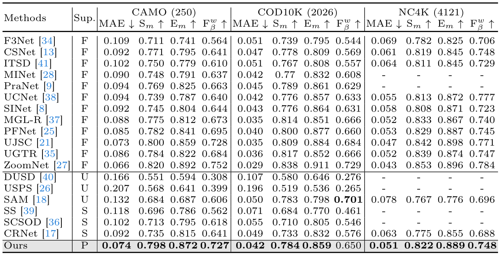

# [ECCV2024] Just a Hint: Point-Supervised Camouflaged Object Detection

# Prerequisites
- python==3.7.5
- torch==1.13.1
- Torchvision==0.14.1
- Scikit_image==0.19.2
- Skimage==0.0
- timm==0.3.2
- tensorboard==2.11.2
- tensorboardX==2.5.1
- tqdm==4.64.1
- einops==0.4.1
- markdown==3.4.3
- markplotlib==3.5.2
- numpy==1.12.6
- opencv-python==4.7.0.72
- openpyxl==3.1.2
- pillow==9.5.0
- pysodmetrics==1.4.0
- PyYAML==6.0
- tabulate==0.9.0

  
# Download P-COD Dataset

- Point supervised PCOD: [google](https://drive.google.com/file/d/17oa6-IU2Dr9Q1KKQ74UoL0hoFd5F7bOd/view?usp=sharing)

# Train
- Generate square clusters (d*d) by point label, [d*d cluster](https://drive.google.com/file/d/1L6l5ijona7J5eX5tX8aGSjwCY1oBdV7L/view?usp=drive_link) , After that training generates [Pred_Map](https://drive.google.com/file/d/1RjgNvc83wnTKAaVcRFg7gxVY85771XGg/view?usp=drive_link) ,then , run Point2gt.py to generate the [final supervisor labels](https://drive.google.com/file/d/1_la4aF9VMv_VG3pQIhc1PXNJa8dxIn26/view?usp=drive_link) .
- Using the labels generated above for training ( "1" stands for foregrounds, "2" for backgrounds, and "0" for unlabeled regions. (The image is viewed as black because its range is 0-255)) . Put it in './CodDataset/train/Label'
- Download training dataset and testing dataset . Put them in the right path, including './CodDataset/train/Imgs', '/CodDataset/test/CAMO/(GT+Imgs)', '/CodDataset/test/COD10K/(GT+Imgs)'.... and '/CodDataset/test/HCK4/(GT+Imgs)'
- Download pretrain [weight](https://drive.google.com/file/d/1169AvHlRnyKdScEHm6yWKSyne3j0N2EZ/view?usp=sharing) and put it in './Point supervised camouflaged object detection/xxx.pth'

- Run python train.py.

# Test and Evaluate 
- Modify path and filename.
- Run python test.py
  
# Experimental Results

# Acknowledgement
[Weakly-Supervised Camouflaged Object Detection with Scribble Annotations](https://github.com/dddraxxx/Weakly-Supervised-Camouflaged-Object-Detection-with-Scribble-Annotations)

