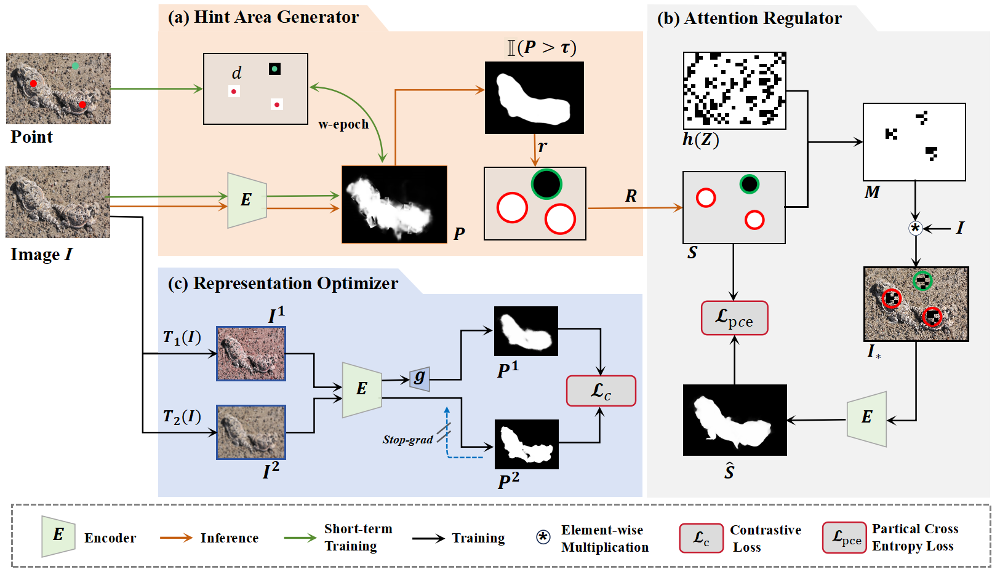

# [ECCV2024] Just a Hint: Point-Supervised Camouflaged Object Detection

# Prerequisites
- python 3.6
- Pytorch 1.12.1
- Torchvision 0.13.1
- Scikit_image=0.19.2
- Skimage=0.0

# Download P-COD Dataset

- Point supervised PCOD: [google](https://drive.google.com/file/d/17oa6-IU2Dr9Q1KKQ74UoL0hoFd5F7bOd/view?usp=sharing)

